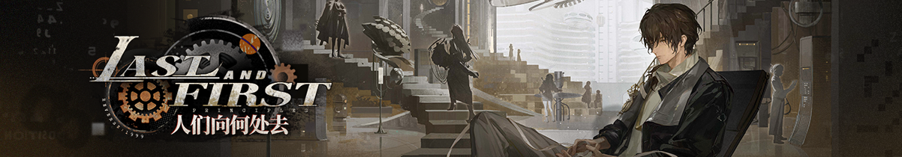

# Reverse: 1999 Story Archive

<p align="center">
  
</p>

<p>
  <a href="https://github.com/foreverCuSO4/reverse-1999-story-archive/releases/latest"><strong>Latest Release (Download Here) / 最新发布 (此处下载)</strong></a>
</p>

<details open>
<summary><strong>简体中文</strong></summary>

## 简介

这是一个面向阅读、检索与下载的 **《重返未来：1999》剧情整理仓库**，当前收录范围为 **1.0 到 3.6**。

仓库内文件基于公开玩家资料进行抓取、清洗、重排与复审，保留剧情正文中的对白、旁白、题记、镜头描写等故事内容，并提供多种导出格式。

## 仓库内容

- `markdown/`：中英双语 Markdown，适合在线浏览、检索和后续维护
- `txt/`：由 Markdown 导出的纯文本版本，适合全文搜索、索引和阅读器导入
- `pdf/`：固定版式 PDF，适合直接阅读、打印或离线分享

当前状态：

- `33` 份 Markdown
- `33` 份 TXT
- `33` 份 PDF
- 覆盖版本：`1.0` 到 `3.6`

## 下载方式

- 单文件浏览：直接查看本仓库中的 `markdown/`、`txt/`、`pdf/`
- 整包下载：前往 [Releases](https://github.com/foreverCuSO4/reverse-1999-story-archive/releases)

当前 release 将提供以下 `9` 个压缩包：

- `1.x` Markdown / TXT / PDF
- `2.x` Markdown / TXT / PDF
- `3.x` Markdown / TXT / PDF

其中：

- `1.x` 指 `1.0` 到 `1.9`
- `2.x` 指 `2.0` 到 `2.8`
- `3.x` 指 `3.0` 到 `3.6`

## 文件命名

```text
版本号-中文标题-English_Title.ext
```

示例：

```text
1.7-今夜星光灿烂-E_lucevan_le_stelle.md
```

## 版权与许可

本仓库包含两类内容，它们的权利范围不同：

- 整理者(我的)：如 README、说明文字、目录组织、命名规范、清洗规则总结、打包与发布说明等
- 官方或第三方权利内容：如游戏原始剧情文本、角色名称、美术、CG、商标、Logo 及其他相关素材

为了避免误导，本仓库**没有**把官方剧情文本整体声明为通用开源内容。更正式的许可与权利边界请见：

- [LICENSE](LICENSE)
- [NOTICE.md](NOTICE.md)

## 说明

- 本仓库是**非官方的民间整理项目**
- 该项目仅供同人创作、语言学习、剧情考据使用，绝对禁止用于任何商业盈利。
- 游戏本体、剧情、角色、美术及相关权利归原权利人所有
- 如相关权利人对收录方式有异议，仓库维护者应配合调整或移除相关内容

## Future Work

- 为可获取的章节补充对应 CG 图片
- 搭建专门的在线阅读 / 下载网站

</details>

<details>
<summary><strong>English</strong></summary>

## Overview

This repository is a **Reverse: 1999 story archive** intended for reading, searching, and downloading. The current coverage is **v1.0 through v3.6**.

The files were assembled from public fan-maintained sources, then cleaned, reorganized, and reviewed. The archive keeps story-relevant content such as dialogue, narration, epigraphs, and scene descriptions, and provides multiple export formats.

## Repository Contents

- `markdown/`: bilingual Markdown files, suitable for online reading, search, and maintenance
- `txt/`: plain text exports generated from the Markdown sources
- `pdf/`: fixed-layout PDFs for direct reading, printing, or offline sharing

Current status:

- `33` Markdown files
- `33` TXT files
- `33` PDF files
- Coverage: versions `1.0` to `3.6`

## Downloads

- Browse individual files directly in `markdown/`, `txt/`, and `pdf/`
- Download grouped packages from [Releases](https://github.com/foreverCuSO4/reverse-1999-story-archive/releases)

The current release provides `9` archive packages:

- `1.x` Markdown / TXT / PDF
- `2.x` Markdown / TXT / PDF
- `3.x` Markdown / TXT / PDF

Where:

- `1.x` means `1.0` through `1.9`
- `2.x` means `2.0` through `2.8`
- `3.x` means `3.0` through `3.6`

## File Naming

```text
version-Chinese_Title-English_Title.ext
```

Example:

```text
1.7-今夜星光灿烂-E_lucevan_le_stelle.md
```

## Copyright and License

This repository contains two different categories of material:

- my own contributions, such as the README, explanatory text, repository organization, naming conventions, curation notes, and release packaging notes
- official or third-party materials, such as the original game story text, character names, artwork, CGs, trademarks, logos, and related assets

To avoid overstating rights, this repository **does not** claim to open-license the official game story as a whole. For the formal scope and rights boundary, see:

- [LICENSE](LICENSE)
- [NOTICE.md](NOTICE.md)

## Notes

- This is an **unofficial fan-made archive**
- This project is intended only for fan creation, language learning, and story or lore research, and must not be used for any commercial purpose
- The original game, story, characters, artwork, and related rights belong to their respective rightsholders
- If a rightsholder objects to the inclusion or presentation of specific materials, the maintainer should review and adjust or remove them as appropriate

## Future Work

- Add chapter CG images where available
- Build a dedicated reading and download website

</details>
